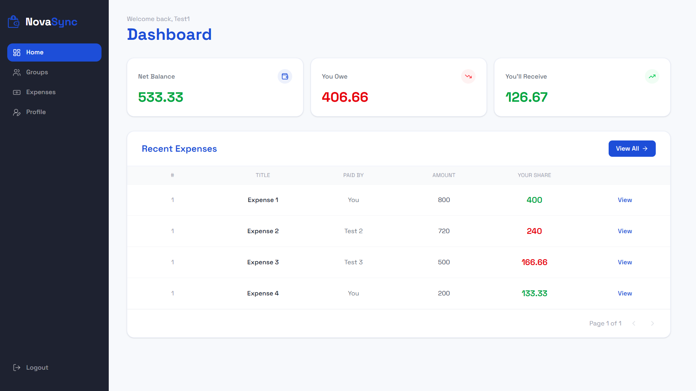

<div align="center">

# 🌌 NovaSync

</div>

---

## 📌 Overview

NovaSync is a smart expense splitting platform designed for groups that share expenses in real life.

It not only tracks who paid what, but also intelligently computes **optimized settlements**, reducing unnecessary transactions and simplifying group payments.

---

## 🖼️ Images

<p align="center">
  
</p>

---

## ⚡ Tech Stack

<p align="center">
  
</p>

## 🚀 Core Features

- 👥 Group creation & member invitations (email / phone / username)
- 💸 Multi-type expense logging (Equal / Exact / Percentage split)
- 🧠 Smart settlement engine (minimum transaction optimization)
- 📊 Live group ledger with filters (user + date based)
- 💬 Lightweight group chat per expense
- 🔄 Real-time balance updates after every transaction
- 📁 Chronological expense history tracking

---

## 🧠 Settlement Logic

NovaSync converts all group expenses into **net balances**:

- Calculates how much each user paid
- Calculates how much each user owes
- Computes final net position

Then it:
- Separates creditors & debtors
- Matches highest values greedily
- Produces a **minimum transaction settlement plan**

---

## 📁 Project Structure

```
NovaSync/
│
├── client/
│   ├── src/
│   │   ├── public/
│   │   ├── components/
│   │   ├── pages/
│   │   └── utils/
│
├── server/
│   ├── controllers/
│   ├── models/
│   ├── routes/
│   ├── middleware/
│   └── utils/
│
├── assets/
│   ├── dashboard.png
│
└── README.md
```

---

## ⚙️ Setup Instructions

### Clone Repository
```bash
git clone https://github.com/your-username/novasync.git
cd novasync
```

### Backend Setup
```bash
cd server
npm install
npm run dev
```

### Frontend Setup
```bash
cd client
npm install
npm run dev
```

---

## 🔐 Environment Variables

```
PORT=5000
MONGO_URI=your_mongodb_uri
JWT_SECRET=your_secret_key
```

---

## 📊 Example Flow

1. Create a group  
2. Add members  
3. Add expenses with different split types  
4. View real-time balances  
5. Generate optimized settlement plan  
6. Close group with minimal transactions  

---

<div align="center">

### 🌌 Built for Recruitathon 2.0 By dangerousEnigma

</div>
